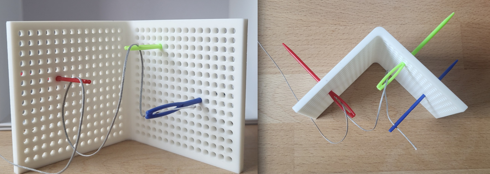
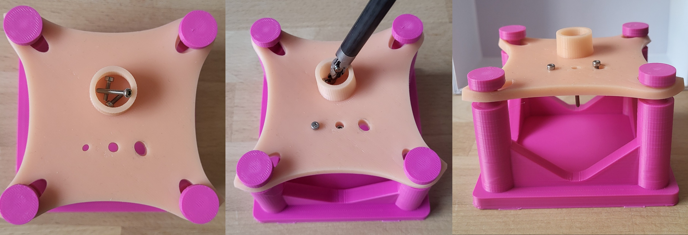

 
# IROS 2026 Forceps-Based Fine Manipulation (FFM) Challenge
 
## IROS 2026 Competition
The Forceps-Based Fine Manipulation (FFM) Challenge aims to advance robotic manipulation of very small objects, a capability that remains challenging for robotic systems while being essential in applications such as precision manufacturing, scientific experimentation, electronics assembly, and surgical robotics.

 Inspired by surgical robotic manipulation, the competition promotes the use of accessible forceps-based robotic systems, such as EndoWrist instruments integrated with robotic arms, while extending the scope beyond medical applications. These approaches can help reduce barriers to entry compared to established platforms such as the da Vinci Research Kit (dVRK), enabling broader participation and encouraging innovation across the robotics community.

 The competition focuses on three key research areas: 
- Hardware Development
- Teleoperation
- Autonomous Control

 
## Registration
### Team Registration

Teams provide and operate their own robotic systems.
 
👉 **Register as a Team**
 
<https://forms.cloud.microsoft/Pages/ResponsePage.aspx?id=JsKqeAMvTUuQN7RtVsVSEAr_4z6hFmdLmqnnKCyMP9pUQk9ORjJTMVZSNExPU0tBRzhPN1FNNVU1Mi4u>
 
### Individual Registration

Individual participants evaluate and compare participating robot systems through teleoperation.
 
👉 **Register as an Individual Participant**
 
<https://forms.cloud.microsoft/Pages/ResponsePage.aspx?id=JsKqeAMvTUuQN7RtVsVSEAr_4z6hFmdLmqnnKCyMP9pUMjIxT0UxNzdQME4zNkhRTFNVTDZZMVIzQS4u>
 
### Participation Capacity
- Maximum 12 robot teams
- Maximum 60 individual participants
 
Participation is accepted on a first-come, first-served basis.

 
# Competition Tasks

## Task 1: Needle Threading
 

Three differently colored plastic sewing needles are inserted into randomly selected locations within an L-bracket needle holder. The orientations of the needle eyes differ by 90° in a randomized arrangement.
 
The order of needle threading and the insertion directions are randomly selected before each trial.

### Objective
 
Guide a thread through all three needle eyes according to:
 
1. The specified order
2. The specified insertion directions
 
Participants may request a new randomized arrangement before starting a trial.

 
## Task 2: Screw Pick-and-Place
 

Three M2 screws are placed inside a silicone dish integrated into a silicone pad fixture.
 
The silicone pad contains three insertion holes designed for screw placement.
 
### Objective

Pick up each screw individually and insert it thread-first into one of the holes.
 
A screw is considered successfully inserted when:
 
- the screw head rests on top of the silicone surface, or
- the screw passes completely through the hole.

 
# Robot Platform Eligibility

The competition is intentionally platform-agnostic. Eligible systems include:

- Single-arm robots
- Dual-arm robots
- Multi-finger robotic hands
- Forceps-based robotic systems
- Surgical robotic research platforms
- Custom-built robotic manipulators

 No remote center of motion (RCM) constraint is required.

Teams may place the competition fixtures anywhere within their robot workspace.
 

# Competition Scenarios

The competition scenarios are based on the following components:

### Commercial Components
- Fgruh 1260-piece M2 Hex Socket Head Screw Kit
- EcoFlex 00-20 FAST Silicone
- Silc Pig Silicone Pigments
- Lunarm Plastic Sewing Needles (70 mm)
- LEREATI 0.8 mm Waxed Thread

### Custom Components

All custom components are manufactured using PLA on a Bambu Lab A1 Mini printer:
 
- Silicone Pad Mold
- Silicone Pad Mount
- Needle Holder L-Bracket
 
Teams are encouraged to obtain identical components for testing and system validation prior to the competition.

### Download
👉 <https://github.com/MEDCVR/Forceps-Manipulation-Challenge/raw/refs/heads/main/IROS_FFM_Setup.zip>
 
### Task 1
- Each correctly threaded needle eye is worth: **1 point**
- A fully successful trial therefore yields: **3 points**

### Task 2 
- Each successfully inserted screw is worth: **1 point**
- A fully successful trial therefore yields: **3 points**

# Team Competition 
Teams accumulate points across three competition phases:

## Day 1: Team Teleoperation 
Robot systems are operated by members of the participating team.

### Requirements 
- Safe system demonstration
- Minimum 2 hours teleoperation operation

### Scoring Objectives 
- 10 successful Task 1 trials
- 10 successful Task 2 trials

### Maximum Score: **60 points**

## Day 2: Independent Participant Evaluation
- Independent participants teleoperate competing robot systems.
- Participants are assigned through a lottery process and will not operate systems from their own institutions.

### Session Duration 
20 minutes per robot

### Trial Structure 
- 6 Task 1 trials
- 6 Task 2 trials
- First trial serves as a warm-up and is not scored

### Maximum Score 
- 30 points per participant
- Best 3 robot systems counted
 
**Maximum Day 2 Score: 90 points**

## Day 3: Autonomous Operation 
- Teams may deploy autonomous control methods such as Imitation Learning.
- During official scoring, robot control computers may not access: Internet connections, local networks, external user inputs

### Evaluation Window 
- 1 hour
- Unlimited attempts are allowed.
- The 5 best successful trials for both tasks are counted.

### Maximum Score: **30 points**
 
 
# Individual Competition
Participants accumulate points through:
 
## Judging
Volunteer judges receive:
- 10 points per hour
- Maximum 30 points

## Teleoperation Performance
Participants complete:
- Task 1 trials
- Task 2 trials

Only the three highest-scoring teleoperation sessions contribute to the final score.

### Maximum Individual Score: **120 points**

# Organizers
 
### Lueder Kahrs
 
University of Toronto
 
### ...
 

 
# Questions
Questions can be submitted through the official competition form:
 
<https://forms.cloud.microsoft/Pages/ResponsePage.aspx?id=JsKqeAMvTUuQN7RtVsVSEAr_4z6hFmdLmqnnKCyMP9pUMUI0UzhRMlNKSTEyWEJYSDhWMkdBMFAyUC4u>
 

 
# Related Competitions
The FFM Challenge builds upon concepts explored in recent robotic manipulation and surgical robotics competitions:
 
- AI for Robotic Surgery, ICRA 2026
- International Challenge on Surgical Autonomy in Real-World Settings, Hamlyn Symposium 2026
- Dexterous Manipulation for Robotic Surgery, BioRob 2026
 

 
# References
- K. L. Schwaner et al., *MOPS: A Modular and Open Platform for Surgical Robotics Research*, ISMR 2021.
- M. Habeeb et al., *Development of an Open Platform Adaptor to Integrate Da Vinci Si Instruments with Collaborative Robotic Systems*, HSMR 2025.
- C. D'Ettorre et al., *Accelerating Surgical Robotics Research: A Review of 10 Years with the da Vinci Research Kit*, IEEE Robotics and Automation Magazine, 2021.
 

 
# Sponsors and Partners
Coming soon.
 

 
# News
### August 2026
Competition website updated with task descriptions, registration forms, and downloadable resources.
